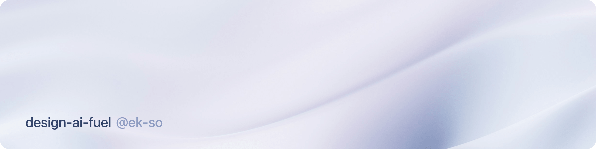

<p align="center">
  
</p>

# design-ai-fuel

Shared agent skills for product designers and product people who build with Cursor (and other agents that read `AGENTS.md` / `.agents/skills`).

## Layout

```text
AGENTS.md
.agents/skills/<skill-name>/SKILL.md
assets/
```

## How to use

1. Clone this repo
2. Copy `AGENTS.md` and `.agents/` into your project root (merge with any existing `.agents/skills/` you already have)

> **Can't see the `.agents/` folder?** Folders starting with `.` are hidden by default. On Mac, press `⇧⌘.` (Shift + Cmd + dot) in Finder to reveal them.

**Skills** — each folder under `.agents/skills/` is one skill. Invoke with `/skill-name`, or describe a matching task and let the agent pick it up from the skill description.

**AGENTS.md** — directional rules for how agents should behave.
